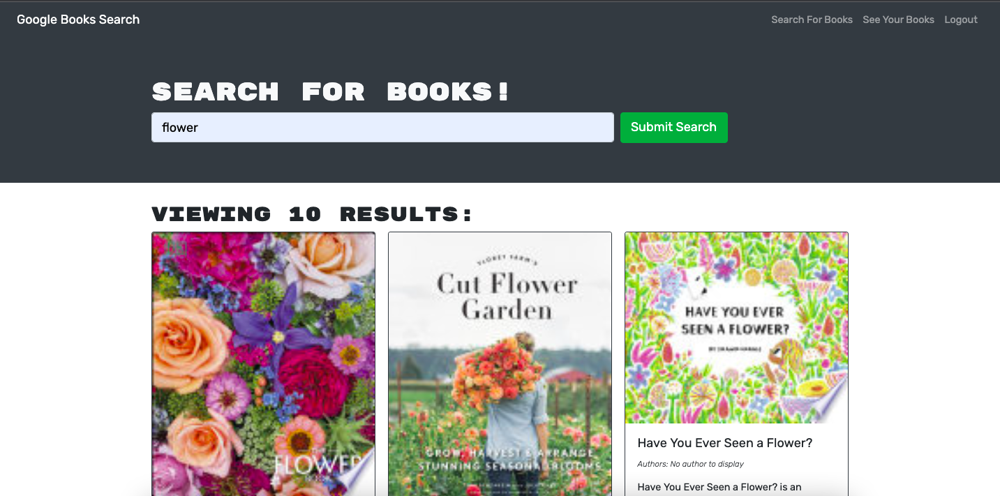

# book-search
This app allows users to search and save book searches. The app was built using the MERN stack, with a React front end, MongoDB database, and Node.js/Express.js server and API. Google Books API search engine built with a RESTful API was refactored to be a GraphQL API built with Apollo Server. 

## Technologies
* MERN (MongoDB, Express, React, Node)
* Apollo GraphQL

## Screenshot

    </img>

## Deployed URL
https://secret-reef-33476.herokuapp.com/

## GitHub Repo
https://github.com/snowden421/book-search